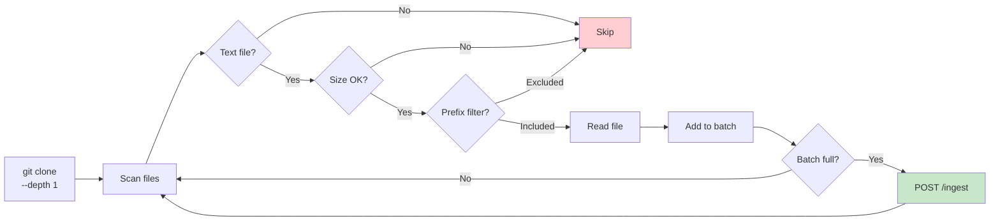

# CLI (raged)

Command-line tool for indexing Git repositories, ingesting arbitrary files, and querying the RAG API.

## Build

```bash
cd cli
npm install
npm run build
```

## Commands

### index

Clone a Git repository, scan for text files, and ingest them into the RAG API.

```bash
node dist/index.js index --repo <git-url> [options]
```

| Flag | Default | Description |
|------|---------|-------------|
| `--repo` | _(required)_ | Git URL to clone |
| `--api` | `http://localhost:8080` | RAG API URL |
| `--collection` | `docs` | Collection name |
| `--branch` | _(default branch)_ | Git branch to clone |
| `--repoId` | _(repo URL)_ | Stable identifier for this repo |
| `--token` | _(env `RAGED_API_TOKEN`)_ | Bearer token for auth |
| `--include` | _(all)_ | Only index files matching this path prefix |
| `--exclude` | _(none)_ | Skip files matching this path prefix |
| `--maxFiles` | `4000` | Maximum files to process |
| `--maxBytes` | `500000` | Maximum file size in bytes |
| `--keep` | `false` | Keep the cloned temp directory |
| `--enrich` | `true` | Enable async enrichment |
| `--no-enrich` | - | Disable async enrichment |
| `--doc-type` | _(auto-detect)_ | Override document type detection |

### query

Search the RAG API for relevant chunks.

```bash
node dist/index.js query --q "<search text>" [options]
```

| Flag | Default | Description |
|------|---------|-------------|
| `--q` / `--query` | _(required)_ | Search query text |
| `--api` | `http://localhost:8080` | RAG API URL |
| `--collection` | `docs` | Collection name |
| `--topK` | `8` | Number of results to return |
| `--minScore` | `auto` | Minimum similarity score cutoff (0-1) |
| `--summary [level]` | _(off)_ | Show Tier-3 summary (`short`, `medium`, `long`; default `medium` if flag is passed without value) |
| `--keywords` | `false` | Show extracted keywords when available |
| `--unique` | `false` | Deduplicate merged query results by payload checksum |
| `--full` | `false` | Download first match's extracted text to `~/Downloads` as `.txt` |
| `--stdout` | `false` | With `--full`, print extracted text to stdout instead of downloading |
| `--download` | `false` | Download first result's raw file to `~/Downloads` |
| `--open` | `false` | Open first result (URL directly, or downloaded file) |
| `--repoId` | _(none)_ | Filter by repository ID |
| `--pathPrefix` | _(none)_ | Filter by file path prefix |
| `--lang` | _(none)_ | Filter by language |
| `--token` | _(env `RAGED_API_TOKEN`)_ | Bearer token for auth |

### ingest

Ingest arbitrary files (PDFs, images, text, Slack exports) into the RAG API.

```bash
node dist/index.js ingest --file <path> [options]
node dist/index.js ingest --dir <path> [options]
```

| Flag | Default | Description |
|------|---------|-------------|
| `--file` | - | Single file to ingest (mutually exclusive with --dir) |
| `--dir` | - | Directory to ingest (mutually exclusive with --file) |
| `--api` | `http://localhost:8080` | RAG API URL |
| `--collection` | `docs` | Collection name |
| `--token` | _(env `RAGED_API_TOKEN`)_ | Bearer token for auth |
| `--maxFiles` | `4000` | Maximum files to process from directory |
| `--batchSize` | `10` | Number of files to include per ingest request batch |
| `--ignore` | _(none)_ | Comma-separated ignore patterns for directory ingest (e.g. `tmp/**,**/*.tmp`) |
| `--ignore-file` | _(none)_ | File with ignore patterns (one per line, `#` comments allowed) |
| `--enrich` | `true` | Enable async enrichment |
| `--no-enrich` | - | Disable async enrichment |
| `--doc-type` | _(auto-detect)_ | Override document type (`code`, `text`, `pdf`, `image`, `slack`) |

**Directory ingest metadata (`--dir`)**

- Each ingested item stores `metadata.rootDir` as the normalized absolute directory used for ingest.
- Each ingested item stores `metadata.relativePath` for path-relative lookup inside that root.
- `metadata.path` is set to the same relative value for compatibility with path-based filtering and indexing.

**`--doc-type` behavior for directory ingest**

- `--doc-type` filters candidates before parsing (for example, `--doc-type pdf` only processes detected PDFs in the directory tree).
- For files that pass the filter, the selected type is also forced for ingestion/parsing.

**Supported file types:**
- **Text/Code**: `.md`, `.txt`, `.ts`, `.js`, `.py`, `.go`, etc. — read as UTF-8
- **PDFs**: `.pdf` — extracted text via pdf-parse with metadata (title, author, pageCount)
- **Images**: `.png`, `.jpg`, `.jpeg`, `.gif`, `.webp` — base64-encoded with EXIF metadata
- **Slack exports**: JSON files in Slack export format

### enrich

Trigger and monitor async enrichment tasks.

```bash
node dist/index.js enrich [options]
```

| Flag | Default | Description |
|------|---------|-------------|
| `--api` | `http://localhost:8080` | RAG API URL |
| `--collection` | `docs` | Collection name |
| `--token` | _(env `RAGED_API_TOKEN`)_ | Bearer token for auth |
| `--force` | `false` | Re-enqueue all items (including already-enriched) |
| `--stats` | `false` | Show enrichment stats without enqueueing |
| `--filter <text>` | _(none)_ | Full-text filter for selecting docs/chunks to enqueue |
| `--clear` | `false` | Clear queued enrichment tasks (can be combined with `--filter`) |

**Behavior:**
- Always shows enrichment statistics first
- Statistics are scoped to the selected `--collection` and optional `--filter`
- By default, enqueues pending items after showing stats
- Use `--stats` to view stats without enqueueing
- Use `--force` to re-enqueue all items (including already-enriched)
- Use `--filter` to enqueue only docs/chunks matching full-text terms (e.g. `invoice`)
- Use `--clear` to remove queued tasks instead of enqueueing new ones

**Examples:**

```bash
# Show enrichment stats only (no enqueueing)
node dist/index.js enrich --stats

# Show stats and enqueue pending items (default)
node dist/index.js enrich

# Show stats and force re-enrichment of all items
node dist/index.js enrich --force

# Re-enrich only invoice-like content
node dist/index.js enrich --force --filter invoice

# Clear queued tasks for invoice-like content
node dist/index.js enrich --clear --filter invoice
```

### graph

Query the knowledge graph for entity information.

```bash
node dist/index.js graph --entity <name> [options]
```

| Flag | Default | Description |
|------|---------|-------------|
| `--entity` | _(required)_ | Entity name to look up |
| `--api` | `http://localhost:8080` | RAG API URL |
| `--token` | _(env `RAGED_API_TOKEN`)_ | Bearer token for auth |

**Example:**

```bash
node dist/index.js graph --entity "AuthService"
```

**Output:**
```
=== Entity: AuthService ===
Type: class
Description: Handles user authentication

=== Connections (2) ===
  → JWT (uses)
  ← UserService (relates_to)

=== Related Documents (3) ===
  - my-repo:src/auth.ts:0
  - my-repo:src/auth.ts:1
  - my-repo:docs/auth.md:0
```

## Index Lifecycle



## Authentication

Two ways to provide the auth token:

1. **Flag:** `--token my-token`
2. **Environment variable:** `export RAGED_API_TOKEN=my-token`

The flag takes precedence over the environment variable.

## Examples

Index a public repo:
```bash
node dist/index.js index \
  --repo https://github.com/fastify/fastify.git \
  --api http://localhost:8080 \
  --collection fastify-docs \
  --include docs/
```

Query with filters:
```bash
node dist/index.js query \
  --api http://localhost:8080 \
  --q "request validation" \
  --topK 5 \
  --collection fastify-docs \
  --lang md
```

Query with long summary + keywords:
```bash
node dist/index.js query \
  --api http://localhost:8080 \
  --collection docs \
  --q "packt invoice" \
  --summary long \
  --keywords \
  --topK 1
```

Download first match as extracted text (`.txt`):
```bash
node dist/index.js query \
  --api http://localhost:8080 \
  --collection docs \
  --q "packt invoice" \
  --full \
  --topK 1
```

Print first match extracted text to stdout:
```bash
node dist/index.js query \
  --api http://localhost:8080 \
  --collection docs \
  --q "packt invoice" \
  --full \
  --stdout \
  --topK 1
```
